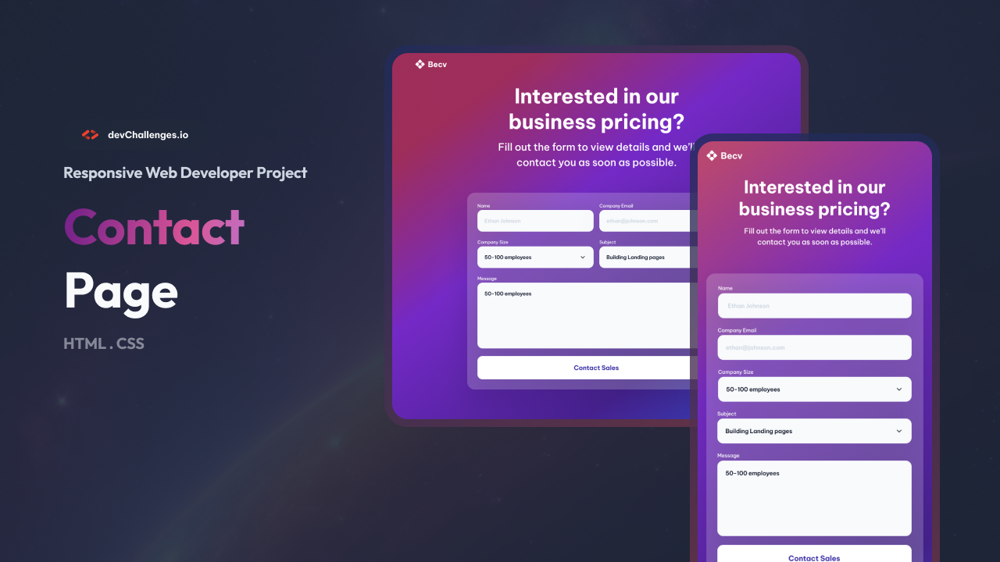
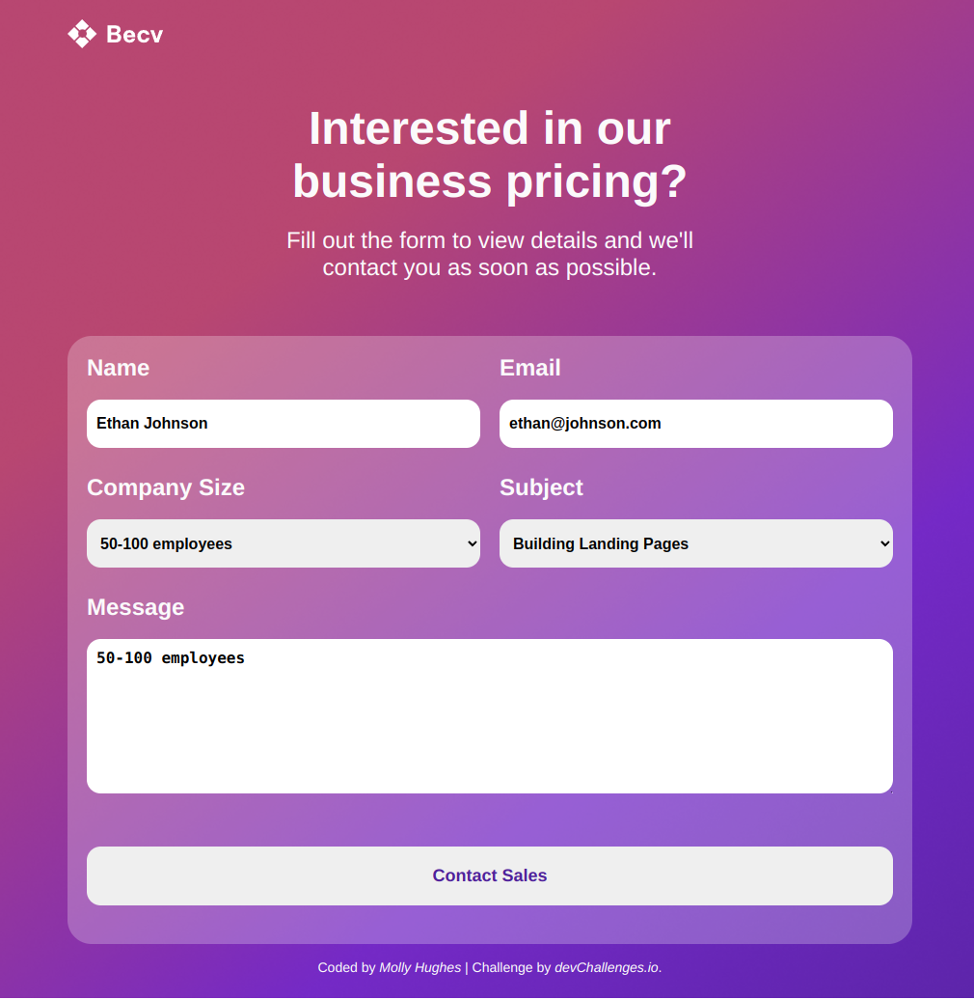

## Table of Contents

- [Overview](#overview)
  - [What I learned](#what-i-learned)
  - [Useful resources](#useful-resources)
- [Built with](#built-with)
- [Features](#features)
- [Contact](#contact)

## Overview

In this project, I took on the challenge of building a contact page as a way to practice my HTML and CSS skills. My goal was to deepen my understanding of responsive design, HTML forms, and media queries. I had previously struggled with concepts like when to use rem, em, and percentages, so I was excited to work through these challenges with this project.

Before taking on the project, I completed the responsive web design and HTML form lessons from DevChallenges.io. These lessons acted as a helpful refresher, providing me with context for the things I was about to implement. Overall, I feel more confident in using media queries to create a responsive layout, but I noticed that I still need to improve my understanding of creating designs that work across all screen sizes. Currently, my layout works well for smaller screens and within the breakpoints I used as inspiration, but there is room for improvement in making the page look great on all devices.

If anyone else is planning to complete this challenge, I highly recommend reviewing the lessons beforehand. It’s easy to overlook important concepts without a solid understanding, and the lessons provide great foundational knowledge.

### What I learned

Throughout this project, I gained a stronger understanding of:

- **Media Queries**: I became more comfortable using media queries to adjust my layout for different screen sizes. By setting specific breakpoints, I was able to create a responsive design that adapts to various devices.

- **Unit Choices (rem, em, px, percentages)**: While I still find it challenging at times, I gained better insight into when and why to use relative units like rem and em compared to fixed units like px. I also better understood the role of percentages in creating fluid layouts.

- **HTML Forms**: I worked on creating accessible, well-structured forms, ensuring that the form elements (inputs, select options, and buttons) were styled appropriately for usability.

### Useful resources

- [PX to REM converter](https://nekocalc.com/px-to-rem-converter) - This tool helped me convert pixel values to rem, which improved the scalability of my design.

### Built with

- Semantic HTML5 markup
- CSS custom properties
- Flexbox
- CSS Grid

## Features

This application/site was created as a submission to a [DevChallenges](https://devchallenges.io/challenges-dashboard) challenge.

## Contact

- GitHub: [Molly Hughes](https://github.com/Molly-Hughes})
